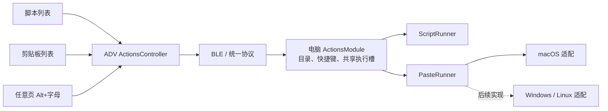

> 状态：已确认

# 技术设计

日期：2026-09-07。用户已确认技术设计，进入任务拆解。

## 1. 采用方案

将现有 ScriptModule / ScriptsController / ScriptsPage 演进为通用动作模块、控制器和列表视图。电脑端只有一份有序动作目录、快捷键索引和执行槽；固件只有一套控制逻辑，持有脚本和剪贴板两个目录视图状态以及一个全局执行状态。

UI 按 type 筛选，列表 Enter 和全局 Alt+字母进入同一执行核心。仅在最后一步根据 type 调用 ScriptRunner 或 PasteRunner。剪贴板正文不作为脚本解释，也不走 shell。



首批采用 macOS 自带 osascript 的 JavaScript for Automation（JXA）桥接 AppKit 写纯文本，再用固定 System Events 指令发送 Command+V。无需新增 Python 依赖。平台选择只发生在适配器工厂，上层不出现系统分支。

## 2. 公共能力复用评估

已检索 desktop 的 config、bootstrap、registry/router、script_module、script_contract、script_runner，以及固件 scripts、input_router、message_codec、connection_session、main、app_shell 和相关测试。

| 能力 | 差距 | 决策与影响 |
| --- | --- | --- |
| ActionConfig / config.py | 仅支持 script 与 Codex，通用 content 解析会 strip | 扩展 clipboard 校验；沿用非法动作隔离，原样读取正文 |
| ScriptModule | 目录、快捷键和忙碌槽仅识别 script | 改为 ActionsModule；直接扩展现有实现，不叠加 ClipboardModule 或第二套 registry |
| script_contract / MessageCodec | ID、目录条目和成功响应绑定脚本及 exitCode | 改为通用动作契约，保留严格校验与长度感知字符串读取 |
| ScriptsController | 目录与执行状态混在一个脚本状态内 | 改为 ActionsController，两个目录状态共享一个执行状态 |
| ScriptsPage | 文案固定为脚本 | 改为 ActionListPage，按 type 提供文案；两个实例只保存各自滚动位置 |
| InputRouter / KeyPressTracker | 已支持 Alt、Fn 优先级和模块方向映射 | 直接复用，仅将路由目标从 scripts 改为 actions |
| ScriptRunner | 可异步执行并清理取消的子进程，但无安全 stdin 数据通道 | 保留脚本执行语义；抽取其取消/回收逻辑供粘贴子进程复用，避免复制两套清理代码 |
| registry / session / outgoing queue | 通道与请求在途所有权已经通用 | 复用；在途 execId 仍持有到响应发送完成，断线等待任务清理 |
| AppShell / 主循环 | 已有公共反馈和会话清理 | 复用，接入两个目录缓存和统一动作反馈；不新建通知系统 |

共享子进程辅助能力只处理创建、stdin 传递、超时、取消和回收，不承担动作注册、权限策略或业务错误文案。脚本原有 cwd、环境、进程组和退出码行为保持。

## 3. 配置与目录

```json
{
  "type": "clipboard",
  "actionId": "clipboard.npm_install",
  "name": "npm install",
  "key": "n",
  "enabled": true,
  "content": "npm install",
  "params": {}
}
```

- configVersion 保持 1，沿用 actions 数组。script ID 规则保持原状；clipboard ID 使用 clipboard. 前缀，后缀非空，总长最多 64 个 ASCII 字符，字符集与 script 相同。
- name 为非空单行，最多 64 UTF-8 字节；key 为单个 ASCII 字母或 null，统一小写。params 缺省为空对象，clipboard 不接受其他参数。
- content 长度为 1～8192 UTF-8 字节，允许全空格或全换行；禁止 NUL 和非法 Unicode。验证与保存均不 trim，不归一化换行。
- 全局 ID 唯一；跨 script/clipboard 的重复 key 合法，按完整有效启用配置顺序首项生效。先计算 effectiveKey，再按 type 筛选和分页，避免两页各自错误认领同一个键。
- 可选平台适配不可用不改变快捷键首项归属；匹配到该动作返回不可用，不回退执行后项，避免触发非预期动作。
- 每次请求按类型分页，每页最多 8 项；每种类型有独立 total/offset。重启桌面服务后目录快照固定到本次会话。

## 4. 统一协议与升级

现有协议的 actions.list 只接收 offset，执行结果强制 script ID 和 exitCode=0；全局快捷键改为混合类型后，旧固件无法正确解码。为避免维持两套行为，协议版本从 1 升到 2，固件与桌面服务配套更新。GATT UUID、JSONL、4096 字节上限、20 字节分片及 execId 规则不变，配置版本不变。

旧版本 hello 按现有严格版本匹配拒绝；不自动降级或重发动作。部署说明要求更新两端，版本不匹配记录本地诊断，设备沿用未连接画面。所有 hello fixtures 和版本测试随之更新；Codex、授时消息内容保持原样。

| 动作 | 请求 payload | 成功 data |
| --- | --- | --- |
| actions.list | `{ "type": "script或clipboard", "offset": 0 }` | type、offset、total、nextOffset、actions |
| actions.execute | `{ "actionId": "clipboard.npm_install" }` | type、actionId、name、exitCode、clipboardWritten、pasteSent、reason |
| actions.shortcut.execute | `{ "key": "n" }` | 与 actions.execute 相同 |

scripts.execute 由 actions.execute 替代，不新增 clipboard.execute。能力声明仅注册三个通用协议动作；hello 的 data 新增 supportedActionTypes 数组（script/clipboard 的受支持子集），用于区分目录为空与平台能力缺失。此字段由运行时执行器可用性生成，不受条目数影响。权限是否已授权不作为类型能力开关，在实际请求中报告。

目录项只包含 type、actionId、name、key、effectiveKey，不包含正文、params 或 enabled。请求 payload 必須严格校验字段，offset 必须是非负整数且按 8 对齐；响应检查 type、数量、分页关系、ID 唯一性与 UTF-8 元数据约束。

执行响应统一结构：

```json
{
  "event": "response",
  "actionId": "actions.execute",
  "execId": "0123456789abcdef",
  "result": {
    "code": "OK",
    "msg": "已发送粘贴",
    "data": {
      "type": "clipboard",
      "actionId": "clipboard.npm_install",
      "name": "npm install",
      "exitCode": null,
      "clipboardWritten": true,
      "pasteSent": true,
      "reason": null
    }
  }
}
```

- result.code 沿用 OK / ERROR / BUSY / TIMEOUT，不扩展顶层错误码集合。
- script：exitCode 为原退出码或 null；clipboardWritten/pasteSent 均为 null，OK 仍要求 exitCode=0。
- clipboard：exitCode 为 null；clipboardWritten/pasteSent 为 true、false 或 null（未确认）。OK 必须两项为 true。开始调用后超时不能伪装为 false。
- reason 使用固定类别：UNAVAILABLE、PERMISSION_DENIED、WRITE_FAILED、PASTE_FAILED、UNCONFIRMED、EXECUTION_FAILED；成功为 null。无目标或非法请求可返回 data=null，原因由固定 msg 表达。
- 无法识别原因的系统错误归入当前阶段失败，不根据本地化错误文本猜权限原因。不得回传原始 stderr 或正文。
- 固件校验外层 actionId、execId、预期目标 ID、响应 type 和类型对应成功条件；快捷键响应允许任一受支持动作类型，不依赖设备目录缓存。

## 5. 电脑执行与平台适配

ActionsModule 持有有序动作集合和一个 busy 标记。目录读取不占执行槽；ID 与快捷键请求先解析目标，再检查 busy，在第一次 await 前占槽，完成或取消清理后 finally 释放。禁止借助等待锁形成隐式执行队列。

统一平台接口：

```python
class PasteRunner(Protocol):
    async def paste(self, text: str) -> PasteResult: ...

# PasteResult: code, reason, clipboard_written, paste_sent
# 状态值允许 None 表示系统调用结果无法确认。
```

build_application 支持注入 PasteRunner。平台工厂在 Darwin 返回 MacOSPasteRunner，其余平台返回显式不可用实现；后续加入 WindowsPasteRunner / LinuxPasteRunner 时无需改协议、设备页面或 ActionsModule。此次不创建空的 Windows/Linux 实现文件，也不宣称整个桌面服务已兼容这两个系统；现有 BLE 与脚本平台适配仍需后续独立验证。

### macOS 流程

1. 使用 asyncio.create_subprocess_exec 执行 `/usr/bin/osascript -l JavaScript -e <固定写入程序>`。固定程序通过 Foundation 的标准输入读取完整 UTF-8 数据，通过 AppKit NSPasteboard.generalPasteboard 显式写入 NSPasteboardTypeString；检查 setString 返回值。正文只经 stdin 传入，不进入参数、脚本源码、环境变量或临时文件。
2. 仅在写入成功确认后，异步等待 50ms，再启动固定粘贴程序：`tell application "System Events" to keystroke "v" using command down`。不使用 activate、不指定目标应用、不模拟输入整段正文。
3. 粘贴程序正常完成后等待 150ms 再释放共享执行槽，降低紧接下一次写入覆盖前一次粘贴的概率。这是内部可测试常量，不暴露用户设置，也不等同于目标应用消费确认。
4. 从写入开始到粘贴与等待完成使用总计 10 秒单调时钟预算，子进程只可消耗剩余时间；超时或会话取消后终止并回收当前子进程，不启动下一阶段。终止宽限与 kill 等待各最多 1 秒，保持与现有脚本清理一致。

不直接采用 pbcopy：本机系统手册表明它会自动识别 RTF/EPS 头，无法保证所有配置内容按纯文本处理。JXA 固定程序显式指定文本类型，兼顾原样 Unicode、首尾空格和格式头场景。

### 权限、取消与副作用

- macOS 辅助功能权限，以及 System Events 自动化授权，由使用说明指导配置到实际启动宿主；系统可能在首次调用时显示授权提示。服务不主动开设置、不激活窗口。首次授权后应重新聚焦输入框并重新触发，不自动补发失败动作。
- 固定程序捕获系统错误并只输出有限状态/数值错误号；匹配已知权限错误号时返回权限提示，其他错误按阶段归类。Python 不保存原始 stderr 文本。
- 写入报告成功但粘贴失败：显示“粘贴失败，文本已复制”；写入结果不明：显示“结果未确认”，不继续粘贴。
- 写入可能先清空剪贴板再失败，不能保证保留旧内容；不做自动恢复。
- 取消发生在子进程创建期间也必须等待创建结束后回收，不能遗留后台任务。若清理不能确认完成，执行器保持不可用，不允许释放后继续发起新的 OS 操作，直至服务重启。
- 无法撤回已经发出的系统事件。其他电脑应用可能修改剪贴板，目标控件也可能异步读取或拒绝粘贴；共享槽只保证本服务的写入与粘贴不交错。原文准确插入仍需人工验证。

## 6. ADV 状态、UI 与会话

ActionsController 保存两个 ActionDirectoryState，按 script/clipboard 索引：status、entries、offset/total/nextOffset、selected、目标页、目录 execId 和启动时间。全局 ActionExecutionState 单独保存 status、execId、请求动作、目标 ID/type、启动时间及反馈。

- hello 完成后只初始化能力和清空状态；首次进入某个动作页时请求该类型第一页。全局快捷键可立即使用，不等待列表。
- 每类仅缓存一页 8 项；切页保留各自目录和选择位置，切回无需重读。目录请求可跨页面完成，按 execId/type 归属更新对应状态。
- 同一类型不重叠请求目录；不同类型目录可以各有一个在途请求，共用原发送队列。
- 目录状态：Unsupported / NotLoaded / Loading / Ready / Failed；执行状态：Idle / Running / Succeeded / Failed / Unconfirmed。
- 目录超时沿用 15 秒；脚本执行等待沿用 45 秒，统一动作等待也采用 45 秒以兼容全局快捷键事前未知类型。电脑端粘贴的 10 秒预算通常更早返回。
- 忙时设备立即提示“动作执行中，请稍候”，不覆盖在途请求，也不生成待执行队列；电脑 busy 再作最终保护。
- 两个 ActionListPage 复用脚本四行布局和滚动算法，仅文案、类型不同。通用执行反馈显示在当前页面底部；快捷触发阶段未知类型时显示“动作执行中”，结果依据返回 type 展示。
- 终态反馈沿用 3 秒显示，先显示结果再拼接名称，避免长名称遮住关键结果。部分失败使用短句“粘贴失败，文本已复制”。
- clearModuleSession 一次清理两个目录、执行状态、滚动位置和请求所有权；到期或旧会话响应不能恢复成功，断线重连不重放。
- 使用已有 InputRouter 方向映射；不改 Fn、Alt 或设置编辑规则。短超时继续在 controller.tick 处理，不新增周期调度任务。

## 7. 实现约束与影响范围

- 改动集中在通用动作相关源码、装配、协议/fixtures、既有动作测试及使用说明；不调整 Codex、设置或 Wi-Fi 业务。
- 新命名建议为 application/actions_module.py、core/action_contract.py、os_adapters/paste_runner.py、firmware/application/actions/actions_controller.* 与 action_list_page.*。移除被替代的脚本专用核心实现，ScriptRunner 作为具体执行器保留。
- 不引入插件注册框架、通用工作流引擎、动作继承树、后台队列或文本历史；仅抽取确实被两个类型使用的能力。
- 注释解释全局首项匹配、纯文本写入、状态未确认、取消清理和会话关联等关键边界，不逐行复述代码。
- 新增配置错误不得包含正文；同时检查未知字段、异常对象或调试日志是否会间接泄露正文。
- 本期不升级依赖、不修改锁文件；JXA 固定程序随 Python 包一起交付，若使用资源文件须验证安装后的资源可读取。

## 8. 验证与需求追踪

| 需求 | 自动化证据 | 人工关注点 |
| --- | --- | --- |
| R-01、R-08 | 工厂注入、不支持平台、hello 类型能力、版本拒绝和会话清理 | Fn+3、旧版本提示、离线设置可用 |
| R-02 | Unicode、全空白、NUL、8192 字节边界、非法项隔离、配置重读 | 修改配置重启后新目录可见 |
| R-03 | 分页/类型校验、跨页选择、错误重读、双页滚动独立 | 四行布局、中文裁剪、超两页目录 |
| R-04 | 混合类型重复 key、列表外快捷执行、统一执行槽和成功解码 | 任意页 Alt、普通字母不触发、设置编辑回归 |
| R-05 | fake 子进程验证固定 argv、正文仅在 stdin、写入先于粘贴、无附加 Enter | 编辑器/浏览器/IDE 实际中文、多行、空格、RTF/EPS 头原文 |
| R-06 | 脚本与粘贴交叉 BUSY、连续完成后再次执行、取消无下一阶段 | 忙碌提示、正常重复粘贴、Codex/授时不阻塞 |
| R-07 | 写入失败不发键、部分失败、未知结果、权限错误、超时与反复取消回收、日志无正文 | 权限未授予与授予后重试、焦点不被服务抢占 |

执行阶段先以注入适配器和 fake 子进程完成新增逻辑测试，再运行现有桌面测试、固件 native 测试及目标构建。JXA 真实系统调用、权限、剪贴板与前台输入必须单独人工验收；本设计阶段未执行任何写剪贴板或模拟按键操作。

## 9. 系统资料依据

- 本机 `man osascript`：支持 JavaScript 语言与固定程序执行；`man pbcopy`：stdin、locale 及 RTF/EPS 自动识别行为（2026-09-07 只读核对）。
- [Apple NSPasteboard setString](https://developer.apple.com/documentation/appkit/nspasteboard/setstring(_:fortype:))：按指定类型写入字符串。
- [Apple WWDC JavaScript for Automation](https://devstreaming-cdn.apple.com/videos/wwdc/2014/306xxjtg7uz13v0/306/306_javascript_for_automation.pdf)：JXA 与 System Events 键盘事件。
- [Apple 辅助功能权限说明](https://support.apple.com/en-gb/guide/mac-help/mh43185/mac)与[自动化权限说明](https://support.apple.com/en-gb/guide/mac-help/mchl108e1718/mac)：实际运行宿主的授权需要人工配置和验证。

以上支持平台接口选择，不构成本项目真实粘贴已验收的证据。

## 10. 待确认问题

无。技术设计已确认，包括协议 v2 配套更新、共享动作控制器与 macOS 固定程序适配方案。
